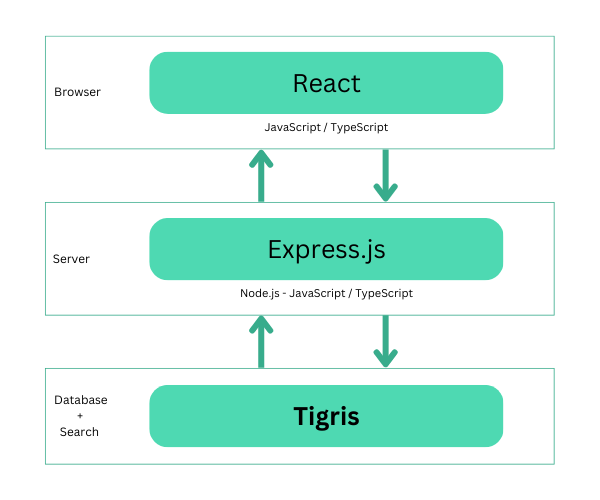

# TERN stack example

TERN is a stack for web development consisting of
[Tigris](https://www.tigris.com) as a database (and search),
[Express.js](https://expressjs.com/) for the web server,
[React](https://react.dev/) for the client, and [Node.js](https://nodejs.org)
for the server runtime.

<center></center>

_This codebase is a fork of the MongoDB
[MERN stack codebase](https://github.com/mongodb-developer/mern-stack-example)._

## Prerequisites

- A
  [Tigris Cloud account](https://console.preview.tigrisdata.cloud/signup?utm_source=github&utm_medium=github&utm_campaign=tern-stack-example)
  or a
  [self-hosted Tigris](https://www.tigrisdata.com/docs/concepts/platform/self-host/?utm_source=github&utm_medium=github&utm_campaign=tern-stack-example)
  instance
- [Node.js LTS or above](https://nodejs.org/en/download)

## How To Run

Create a `tern/server/config.env` from the `tern/server/config.env.example`:

```sh
cp tern/server/config.env.example tern/server/config.env
```

Create a project in Tigris (e.g. via the
[Tigris Cloud Console](https://console.preview.tigrisdata.cloud/?utm_source=github&utm_medium=github&utm_campaign=tern-stack-example))
and populate the configuration values in the `config.env` file:

```
TIGRIS_CLIENT_ID={TIGRIS_CLIENT_ID}
TIGRIS_CLIENT_SECRET={TIGRIS_CLIENT_SECRET}
TIGRIS_PROJECT=mern-to-tern
TIGRIS_URI=api.preview.tigrisdata.cloud
TIGRIS_DB_BRANCH=main
PORT=5000
```

Start the server:

```
cd tern/server
npm install
npm start
```

Start the client:

```
cd tern/client
npm install
npm start
```

## Tests

The MERN code base came with some tests that don't appear to run by default when
running `npm test`. However, you can manually run the existing two tests by
starting the client and server (as above) and then running:

```sh
node_modules/.bin/cypress run cypress/integration/endToEnd.spec.js
```

## Get involved

- 💻 Contribute to [Tigris](https://github.com/tigrisdata/tigris), the open
  source serverless NoSQL and Search platform
- 🌱 Join the
  [Tigris Discord](https://www.tigrisdata.com/discord/?utm_source=github&utm_medium=github&utm_campaign=tern-stack-example)
